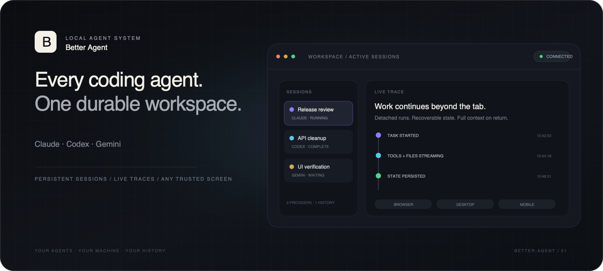
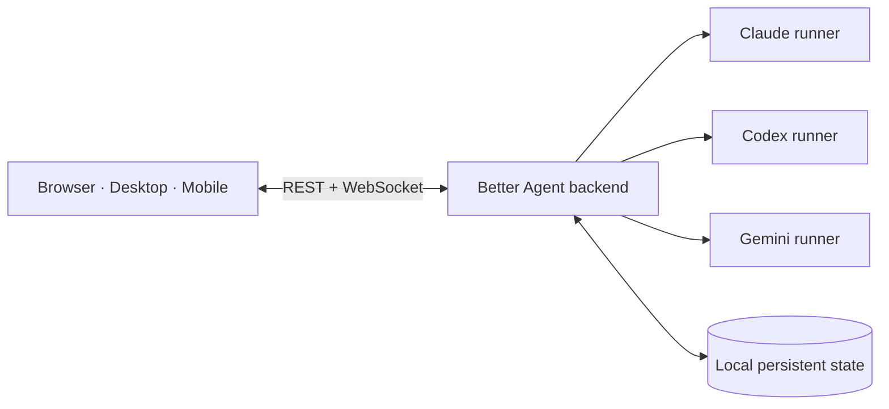

<p align="center">
  
</p>

<h1 align="center">Better Agent</h1>

<p align="center"><strong>Run every coding agent. Keep every session.</strong></p>

<p align="center">
  Claude, Codex, and Gemini in one local workspace—persistent, inspectable, and available from every trusted screen.
</p>

<p align="center">
  <a href="https://github.com/ofekron/better-agent/stargazers"></a>
  <a href="https://github.com/ofekron/better-agent/commits"></a>
  <a href="LICENSE"></a>
  <a href="INSTALL.md"></a>
</p>

<p align="center">
  <a href="#quick-start"><strong>Quick start</strong></a> ·
  <a href="#why-better-agent"><strong>Why Better Agent</strong></a> ·
  <a href="#how-it-works"><strong>How it works</strong></a> ·
  <a href="INSTALL.md"><strong>Install guide</strong></a> ·
  <a href="EXTENSIONS.md"><strong>Extensions</strong></a>
</p>

> [!NOTE]
> Better Agent is source-available for non-commercial use. See the [license](#license).

## Quick start

```bash
git clone https://github.com/ofekron/better-agent
cd better-agent
./run.sh
```

The first run initializes dependencies, builds the UI, and guides you through local authentication and network access. See [Getting started](#getting-started) for prerequisites and platform notes.

## Why Better Agent

Stop juggling terminal tabs, provider UIs, hidden logs, and throwaway sessions.

- **Every provider, one workspace.** Run Claude, Codex, and Gemini side by side. Choose the provider and model per session without changing how you organize or revisit work.
- **Work that survives the tab.** Detached agents outlive browser disconnects and backend restarts. Return to the complete run and its full trace.
- **A team, not a chatbot.** Fork sessions, delegate bounded work, run agents in parallel, and orchestrate them headlessly through the SDK and CLI.
- **Local and inspectable.** Sessions, settings, credentials, project data, live output, tool calls, and file context stay on your machine and remain visible in one history.
- **One backend, every trusted screen.** Use the same workspace from the browser, desktop app, or mobile app on devices you trust.

## Built for real agent work

- **Persistent sessions** — recover in-flight provider work after restarts and reconcile it into one deduplicated history.
- **Offline-first capture** — create sessions and queue prompts while the backend is unreachable; sync them after reconnect.
- **Project organization** — folder trees, tags, session tabs, quick filters, and advanced search across your work.
- **Provider-native setup** — connect the Claude, Codex, and Gemini accounts and CLIs you already use.
- **Multi-agent orchestration** — fork, delegate, supervise, and coordinate work across providers.
- **Extension platform** — add permission-scoped workflows, tools, settings, and UI through signed marketplace or private extensions.

## How it works



The FastAPI backend is the source of truth for sessions, projects, settings, provider state, and agent output. The React frontend reflects backend snapshots and live WebSocket events. Per-session runners stay detached so work can continue independently of the UI.

| Layer | What it owns |
| --- | --- |
| **Backend** | Orchestration, event ingestion, provider runners, authentication, persistence, and recovery |
| **Frontend** | Responsive browser, desktop, and mobile interfaces over one reconnecting session stream |
| **Local state** | Sessions, traces, settings, credentials, projects, and extension data on your machine |

## SDK and extensions

The public Integration SDK lives in `sdk/better_agent_sdk/`. Extensions and external orchestrators run out of process and call authenticated loopback APIs instead of importing backend internals.

Two included extensions demonstrate the model:

- [`extensions/ask`](extensions/ask) finds the best existing session for a task and continues the work there.
- [`extensions/session-bridge`](extensions/session-bridge) exposes cross-session search, recall, proposals, and delegation through MCP.

See [EXTENSIONS.md](EXTENSIONS.md) to build private or marketplace extensions.

## Getting started

**Supported hosts:** macOS, Linux, and Windows. Authentication uses the native OS credential store. The macOS desktop build is verified; a Windows installer is provided but has not yet been validated on a real Windows host.

On a fresh machine, start with the platform bootstrap:

```bash
# macOS
./scripts/bootstrap-macos.sh

# Windows PowerShell
powershell -ExecutionPolicy Bypass -File scripts\bootstrap-windows.ps1
```

Then run `./run.sh`. The backend defaults to port `18765`; set `BETTER_AGENT_BACKEND_PORT` to override it. On first launch, choose local-only or trusted-LAN access and create credentials stored by your OS.

The complete clean-clone, LAN, desktop, mobile, and reset-auth flows are in [INSTALL.md](INSTALL.md).

<details>
<summary><strong>Developer commands</strong></summary>

```bash
# Backend with hot reload
cd backend
source .venv/bin/activate
uvicorn main:app --reload --port 8000

# Frontend
cd frontend
npm run dev

# Headless CLI
cd backend
source .venv/bin/activate
python cli.py -p "do the thing"

# Reset stored credentials
./run.sh --reset-auth
```

</details>

## Security

> [!WARNING]
> Better Agent can execute commands, read and write files, invoke provider CLIs, and persist local data. Run it only in trusted environments, keep backups, review tool calls, and never expose the backend to untrusted networks.

Normal API access is credential-gated. Browser clients use a signed session cookie; mobile clients use signed bearer tokens; internal extension and runner routes require a separate loopback token. Public unauthenticated routes are limited to setup, authentication, and served app artifacts.

Read [SECURITY.md](SECURITY.md) and [DISCLAIMER.md](DISCLAIMER.md) before public or shared use.

## Contributing

Read [CONTRIBUTING.md](CONTRIBUTING.md) before opening a pull request. Integration tests run real provider CLI subprocesses rather than mocks.

Public planning and release policies live in [ROADMAP.md](ROADMAP.md) and [RELEASE.md](RELEASE.md).

## License

Better Agent is source-available for non-commercial use. Commercial use, commercial distribution, hosted offerings, and Better Agent marketplaces require prior written permission from Ofek Ron. It is not OSI-approved open-source software because commercial rights are reserved. See [LICENSE](LICENSE).

Additional legal and trust material: [DISCLAIMER.md](DISCLAIMER.md) · [SECURITY.md](SECURITY.md) · [TRADEMARKS](TRADEMARKS) · [NOTICE](NOTICE)

---

<p align="center"><strong>One agent in a terminal was never going to be enough.</strong></p>
